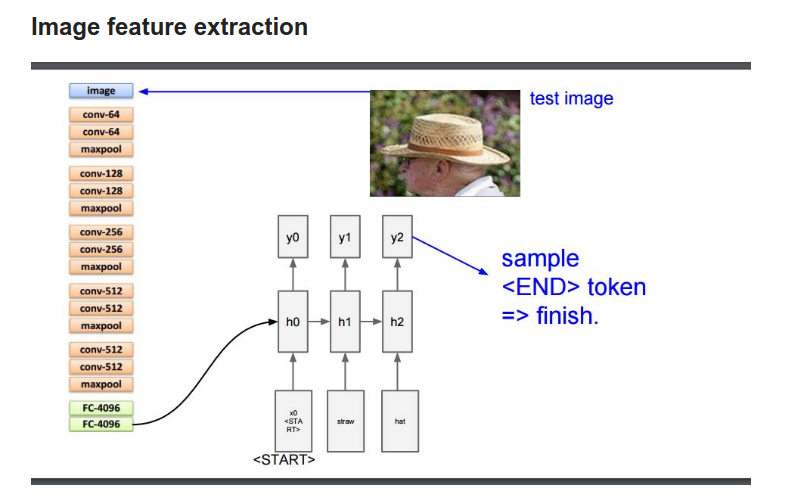
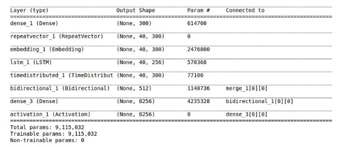
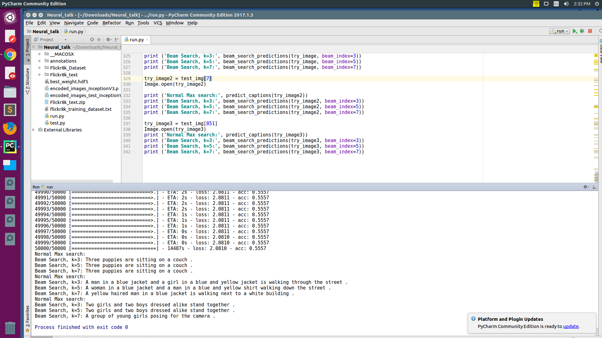

# NeuralTalk
[Next Tech Lab](http://nextech.io/)'s NeuralTalk - an image captioning model trained using Flickr8k dataset, and programmed in Python and Keras.  

Features are extracted using [InceptionV3](https://www.kaggle.com/google-brain/inception-v3), and predictions are made using [beam search](https://en.wikipedia.org/wiki/Beam_search).

## Architecture

## Output

## **Dependecies**
[Keras](https://github.com/fchollet/keras)

[Numpy](https://docs.scipy.org/doc/numpy-1.13.0/user/install.html)
